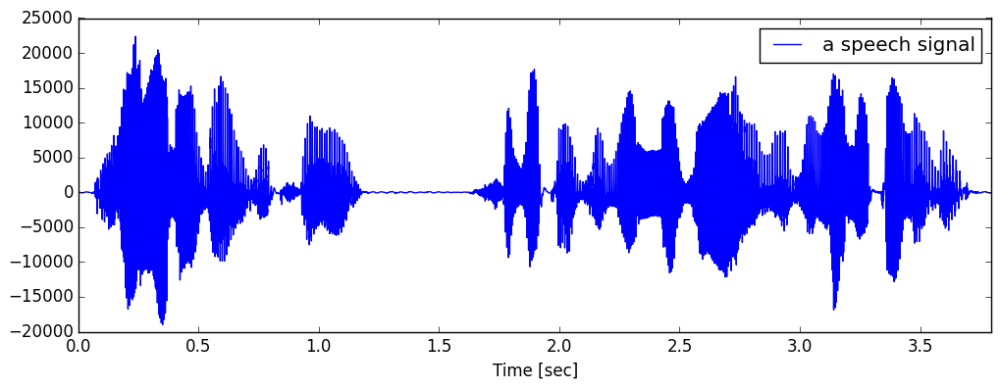
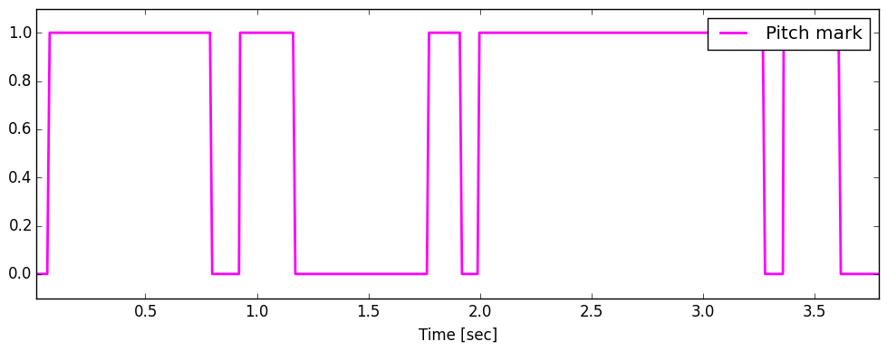
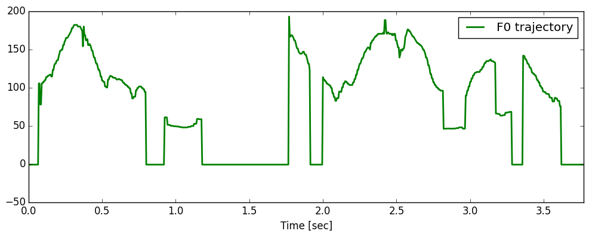
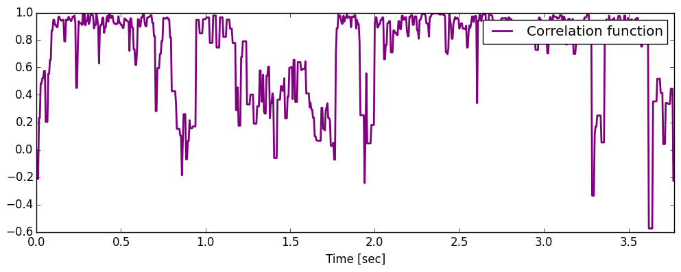

# REAPER

[](https://travis-ci.org/r9y9/REAPER.jl)
[](https://coveralls.io/r/r9y9/REAPER.jl)

A Julia interface for [REAPER](https://github.com/google/REAPER).

## High level interface

```julia
# Compute pitch mark, F0 and normalized cross-correlation function simultaneously
pm_times, pm, f0_times, f0, corr = reaper(x, fs)
```

where `fs` is sampling frequency and `x::Vector{Int32}` is a input monoral speech signal like:



### Pitch mark



### F0



### Normalized cross-correlation function



For the complete code of visualizations shown above, please check [the ijulia notebook](http://nbviewer.ipython.org/github/r9y9/REAPER.jl/blob/master/examples/REAPER%20demo.ipynb).

## Notice

- This is not an official package
- REAPER.jl is based on a slightly modified version of REAPER (see [here](https://github.com/r9y9/REAPER/tree/cwrap))
